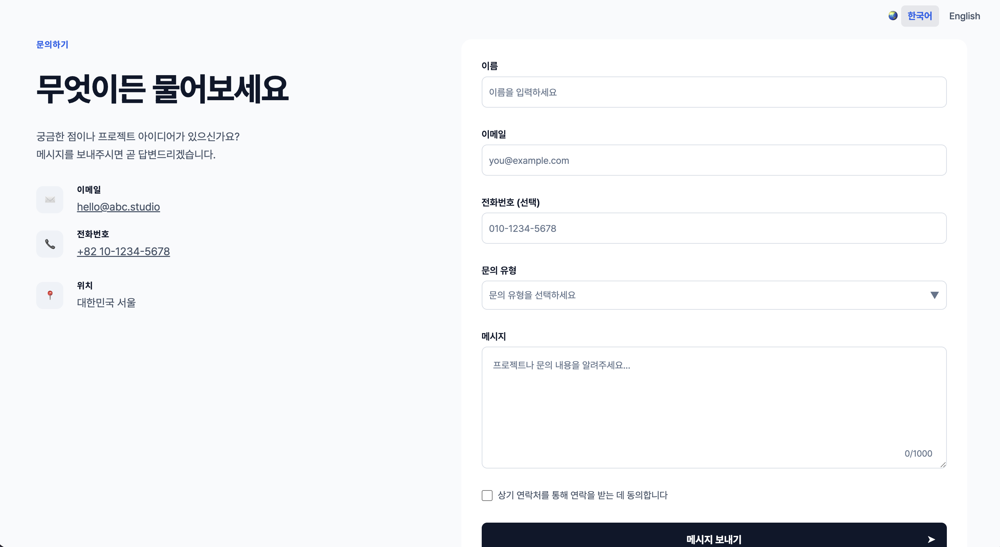

<h1 align="center">폼 데이터 검증을 지원하는 문의하기 페이지</h1>

<p align="center"><b>프론트엔드 프로젝트 #4</b></p>

<p align="center"></p>

<p align="center">사용자가 입력한 폼 데이터를 검증하고 요청에 따라 폼을 초기화할 수 있는 문의하기 페이지</p>

### <div align="center"><a href="https://nimus-oes.github.io/contact-form-validated/">라이브 데모 보기</a></div>

<br>

## 목차

- [프로젝트 요구사항](#프로젝트-요구사항)
- [기술 스택](#기술-스택)
- [디렉터리 구조](#디렉터리-구조)
- [AI 페어 프로그래밍](#AI-페어-프로그래밍)
- [핵심 기능 구현](#핵심-기능-구현)
- [프로젝트를 통해 배운 것](#프로젝트를-통해-배운-것)

<br>

## 프로젝트 요구사항

### 1. 목표

React와 TypeScript를 사용해 한국어와 영어를 지원하는 반응형 컨택트 폼을 구현한다.

사용자는 연락처와 문의 내용을 입력하고 제출할 수 있다. 제출 데이터는 서버로 전송하거나 저장하지 않으며, 클라이언트에서 검증을 통과하면 제출 완료 화면을 표시한다.

핵심 구현 범위는 다음과 같다.

- React Hook Form을 이용한 폼 데이터 검증
- Radix 기반의 헤드리스 UI로 커스텀 폼 디자인 구현
- CSS Modules를 이용한 컴포넌트 스타일링
- TypeScript 데이터 모델 정의
- `react-i18next`를 이용한 한국어·영어 지원

<br>

### 2. 폼 검증

React Hook Form을 사용해 폼 데이터를 검증한다. 검증 흐름은 다음과 같다.

- 최초 검증 시 사용자가 입력하는 동안에는 검증하지 않고 제출 버튼을 눌렀을 때 전체 폼을 검증한다
- 최초 검증에 실패한 이후에는 사용자가 입력 항목을 벗어날 때마다 재검증한다
- 오류가 있는 필드는 오류 상태와 메시지를 표시하고 가장 먼저 발견된 오류 필드로 포커스를 이동한다
- 오류가 하나라도 발견되면 제출 성공 화면으로 이동하지 않는다
- 검증에 성공하면 제출 성공 화면으로 전환한다
- 성공 화면에서 다시 작성하기 버튼을 누르면 폼 데이터와 오류를 초기화하고 입력 화면으로 돌아간다

상세 검증 규칙은 다음과 같다.

| 입&#8288;력&nbsp;항&#8288;목 | 허용 값                        | 필&#8288;수 여&#8288;부 | 검증 규칙                                            | 검증 실패 메시지                                                           |
| ---------------------------- | ------------------------------ | ----------------------- | ---------------------------------------------------- | -------------------------------------------------------------------------- |
| 이름                         | Unicode 문자열                 | 필수                    | 앞뒤 공백 제거 후 1~50자                             | `"이름은 비워둘 수 없습니다"` / `"이름은 50자를 초과할 수 없습니다"`       |
| 이메일                       | 이메일 문자열                  | 필수                    | 빈 값이 아니며 일반적인 이메일 형식이어야 함         | `"이메일은 비워둘 수 없습니다"` / `"이메일 형식이 올바르지 않습니다"`      |
| 전화번호                     | 숫자, 공백, `-`, `+`, `(`, `)` | 선택                    | 비워둘 수 있고 입력된 값에 대한 검증을 실행하지 않음 |                                                                            |
| 문&#8288;의&nbsp;유&#8288;형 | 드롭다운 항목의 고정 식별자    | 필수                    | 기본 플레이스홀더는 선택값으로 인정하지 않음         | `"필수 선택 항목입니다"`                                                   |
| 메시지                       | Unicode 문자열                 | 필수                    | 앞뒤 공백 제거 후 1~1000자                           | `"메시지는 비워둘 수 없습니다"` / `"메시지는 1000자를 초과할 수 없습니다"` |
| 연&#8288;락&nbsp;동&#8288;의 | 체크박스 선택값 `true`         | 필수                    | 체크박스를 선택해야 함                               | `"연락에 동의해야 합니다"`                                                 |

<br>

### 3. 다국어 지원

페이지는 한국어와 영어를 지원하고 사용자가 선택한 언어는 다음 방문에도 적용되도록 브라우저에 저장한다.

표시 언어는 다음 우선순위로 결정한다.

1. 사용자가 이전에 선택하고 저장한 언어
2. 사용자의 브라우저 언어
3. 기본 언어인 한국어

사용자가 폼을 작성하는 과정에서 언어를 변경해도 다음 데이터는 유지한다.

- 작성 중인 폼 데이터
- 선택한 문의 유형
- 메시지 글자 수
- 현재 표시 중인 검증 오류

UI에 사용되는 모든 문자열은 번역 리소스로 관리한다.

<br>

### 4. 접근성

- 모든 입력 요소에 연결된 레이블을 제공한다
- 오류 메시지를 해당 입력 요소와 연결한다
- 오류가 있는 입력 요소의 상태를 보조 기술이 인식할 수 있게 한다
- 키보드만으로 모든 입력 요소와 버튼을 조작할 수 있게 한다
- 포커스된 요소를 시각적으로 구분할 수 있게 한다
- 오류 상태를 색상만으로 표현하지 않는다

<br>

## 기술 스택

- 타입 시스템: TypeScript 6.0.3
- UI 구성: React 19.2.8
- 폼 검증: React Hook Form 7.87.0
- 컴포넌트 프리미티브: Radix UI 1.6.7
- 국제화: react-i18next 17.0.13, i18next-cli 1.73.2
- 빌드 툴: Vite 8.2.2
- 스타일링: CSS 모듈
- 배포: GitHub Pages

<br>

## 디렉터리 구조

```markdown
contact-form-validated/
├── public/
│ └── locales/
│ ├── en/translation.json
│ └── ko/translation.json
└── src/
├── assets/
├── components/
│ ├── ContactForm.tsx
│ ├── ContactInfo.tsx
│ ├── LanguageSelector.tsx
│ └── SubjectSelect.tsx
├── App.tsx
├── i18n.ts
├── main.tsx
└── models.ts
```

### 컴포넌트 계층

```markdown
<App>
├── <LanguageSelector>
└── 화면 콘텐츠
    ├── <ContactInfo>
    └── <ContactForm>
        └── <SubjectSelect>
```

- LanguageSelector: 언어 선택 메뉴
- ContactInfo: 페이지 안내 및 연락 정보
- ContactForm: 문의 폼 및 제출 성공 화면
- SubjectSelect: 문의 폼의 드롭다운 입력 항목

<br>

## AI 페어 프로그래밍

이번 프로젝트는 Codex와 함께하는 페어 프로그래밍 방식으로 진행되었다. Codex는 페어 프로그래머로서 현재 코드를 분석하고 디버깅 방안과 구현 대안을 제시하는 역할을 담당했고 별도의 요청이 없는 한 개발자를 대신해 코드를 변경하지 않았다. 대부분의 코드는 Codex와 논의를 거친 후 직접 구현하는 방식으로 작성되었다.

**`AGENTS.md` 파일에 작성된 핵심 원칙**

```markdown
Codex는 사용자의 페어 프로그래머로 행동한다. 사용자가 직접 코드를 작성하면서 개발을 학습할 수 있도록 하고, 사용자를 대신해 기능을 구현하지 않는다.
목표는 Codex가 프로젝트를 대신 만드는 것이 아니라 사용자가 직접 프로젝트를 만들면서 더 좋은 개발 판단을 할 수 있도록 돕는 것이다. 속도보다 이해와 학습을 우선한다.
```

Codex에 제공한 지침 전문은 본 리포지터리의 `AGENTS.md` 파일에서 확인할 수 있다.

Codex 활용이 특히 유용했던 부분은 다음과 같다.

- i18next-cli로 추출된 i18n 키 이름을 의미 기반 키 이름으로 전환하기 (예: `nameCannotExceed50Characters` → `validation.name.maxLength`)
- 지정된 폰트를 레퍼런스 디자인에 따라 각 요소에 상세 적용하기
- 접근성 기준에 따라 `px` 값과 `rem` 값을 사용할 영역 구분하기
- CSS 변수를 이용해 색상과 사이즈 시스템 구현하기

<br>

## 핵심 기능 구현

### 1. 폼 데이터 검증

#### 🟢 입력값의 앞뒤 공백 제거

입력값의 앞뒤 공백을 어디까지 제한할 것인지에 따라 구현 방식이 달라진다. 화면에 보이는 값은 그대로 유지하고 검증 단계에서만 제거할 수도 있고 사용자가 입력을 마칠 때마다 화면에 보이는 값도 정리할 수 있다. 여기서는 `onBlur: () => {setValue()}`를 이용해 화면에 표시되는 값도 함께 정리했다.

#### 🟢 이메일 검증 패턴

이메일 검증은 보통 다음 방식으로 이루어진다.

1. 프론트엔드에서 빈 값과 기본 형식 검사
2. 서버에서도 동일하게 검사
3. 인증 메일을 통해 이메일 소유 여부 확인

프론트엔드 단에서 이메일을 검증하는 정규식은 다음과 같이 구성했다.

- 공백 없음
- `@` 앞에 공백과 `@`가 아닌 문자가 하나 이상 있음
- `@` 뒤에 `.`과 문자가 있음 (도메인에 `.`이 있음)

#### 🟢 폼 초기화 흐름

폼 제출의 성공 여부는 `isSuccess`라는 React 상태로 관리된다. 이 `isSuccess` 값을 기준으로 기본 폼 화면과 폼 제출 성공 화면이 조건부 렌더링된다.

```
  if (isSuccess) {
    return // 폼 제출 성공 화면
  }

  return // 기본 폼 화면
```

폼 제출 성공 화면에서 사용자가 재작성 버튼을 클릭할 경우, RHF의 `reset()` 메서드가 호출되어 폼 작성 내용이 초기화되고 `setIsSuccess(false)`에 따라 폼 화면이 다시 렌더링된다.

```
  const handleWriteAgain = () => {
    reset();
    setIsSuccess(false);
  };
```

<br>

### 2. 국제화(i18n) 및 현지화(l10n)

#### 🟢 문자열에서 i18next 키 추출

i18next-cli가 제공하는 `instrument` 명령을 이용해 하드코딩된 문자열을 i18next 키로 변환했다.

> `<p>"Name cannot exceed 50 characters"</p>`
>
> ↓
>
> `<p>{t("nameCannotExceed50Characters", "Name cannot exceed 50 characters")}</p>`

#### 🟢 의미 기반 키 이름 사용

i18next-cli의 강점은 하드코딩 문구를 탐지하여 t() 함수를 자동 삽입하고, 이에 따라 언어 JSON 파일을 추출하는 데 있다. 하지만 `instrument` 추출 기능을 사용할 경우 키 이름을 문자열 그대로 사용하는 결과가 발생하게 된다. i18n 키 이름은 문자열의 내용이 아니라 역할을 표현해야 한다. 이는 개발 작업뿐만 아니라 이후의 로컬라이제이션 단계에서도 많은 작업자들에게 영향을 미치기 때문에 초기에 올바르게 설정하는 것이 중요하다.

의미 기반 키가 중요한 이유는 다음과 같다.

- 문구를 수정해도 키를 변경할 필요가 없음 (키 유지관리 용이)
- 번역 시스템(TMS) 내에서 키의 문구 변동 기록을 관리할 수 있음
- 같은 문구가 서로 다른 맥락에서 사용되는 것을 구분할 수 있음
- 번역자가 문구의 맥락을 이해할 수 있음

여기서는 i18next-cli로 키를 생성한 후 Codex를 통해 각 키의 이름을 의미 기반으로 변경했다.

> `<p>{t("nameCannotExceed50Characters", "Name cannot exceed 50 characters")}</p>`
>
> ↓
>
> `<p>{t("validation.name.maxLength", "Name cannot exceed 50 characters")}</p>`

#### 🟢 i18next 언어 상태와 언어 선택 UI, HTML 언어값 동기화

이 프로젝트에서 언어 정보가 저장되는 지점은 3곳이다.

- i18next 설정값: 전체 언어 리소스
- 언어 선택 메뉴: 사용자가 선택한 언어 정보
- HTML 언어값: 브라우저에 전달되는 언어 정보

세 지점의 정보가 서로 동기화되지 않을 경우 각 지점의 언어 정보가 불일치하는 문제가 발생할 수 있다(예: 최초 화면에서 현재 콘텐츠에 사용된 i18next 언어값이 언어 선택 UI에 반영되지 않음, 콘텐츠 언어가 변경되어도 HTML 언어값이 변경되지 않음).

여기서는 i18next 설정값을 단일 출처(Single Source of Truth)로 사용하여 언어 선택 UI와 HTML 언어값이 해당 정보를 참조하도록 설정했다.

```
    <input
    id="language-ko"
    type="radio"
    name="languages"
    value="ko"
    onChange={changeLang}
    checked={i18n.resolvedLanguage === "ko"}
    />
    <label htmlFor="language-ko">한국어</label>
```

언어 선택 항목은 `i18n.resolvedLanguage`의 값에 따라 선택 여부가 결정되는 제어 입력이다. 사용자가 언어를 변경하면 `changeLang` 함수를 통해 i18next 언어 설정이 변경되고 이에 따라 언어 선택 UI도 변경된다.

```
  useEffect(() => {
    document.documentElement.lang = i18n.resolvedLanguage ?? "ko";
  }, [i18n.resolvedLanguage]);
```

useEffect를 이용해 `i18n.resolvedLanguage` 값의 변경이 감지되면 HTML 언어를 변경한다.

<br>

### 3. 접근성 및 UX

#### 🟢 네이티브 `required` 속성 추가

스크린리더가 필수 입력 여부를 인지할 수 있도록 `input` 요소와 Radix Select의 <Select.Root> 요소에 네이티브 `required` 속성을 추가했다.

#### 🟢 오류 메시지와 입력 요소 연결

브라우저의 네이티브 검증을 사용할 경우 브라우저가 오류 상태와 오류 내용을 접근성 트리에 전달하는데, 커스텀 검증 방식에서는 이를 직접 구현해야 한다. 여기서는 `aria-invalid={Boolean(errors.입력요소이름)}`를 통해 오류 발생 여부를 연동하고 `aria-describedby={errors.입력요소이름 ? "오류메시지id" : undefined}`를 통해 오류 메시지를 연동하여 입력 요소와 오류 메시지가 접근성 트리에서 명시적인 관계를 가지도록 했다.

#### 🟢 스크린 리더에 화면 전환 사실 전달

이 프로젝트에서는 폼 제출 성공 여부를 나타내는 `isSuccess` 상태값에 따라 기본 폼 화면과 제출 성공 화면이 조건부 렌더링된다. 브라우저 관점에서는 React의 조건부 렌더링이 계속 같은 페이지를 나타내기 때문에 화면 전환 사실이 스크린 리더에 전달되지 않는 문제가 발생할 수 있다. 여기서는 폼이 사라지고 성공 화면으로 바뀌었을 때 스크린 리더 사용자가 화면 전환을 인지할 수 있도록 새 화면의 제목으로 포커스를 이동시키는 방식을 구현했다.

#### 🟢 스크린 리더에서 아이콘 숨김

주변의 텍스트가 충분한 정보를 전달하는 상태에서 장식적인 역할만 하는 아이콘은 `aria-hidden="true"`을 이용해 스크린 리더가 읽지 못하도록 숨김으로 처리했다.

#### 🟢 오류 메시지 공간 예약

오류 메시지가 나타날 때 콘텐츠가 아래로 밀리고 시각적으로 혼동을 주는 문제를 방지할 수 있도록 처음부터 오류 메시지의 높이를 반영하여 폼의 레이아웃을 구성했다.

<br>

## 프로젝트를 통해 배운 것

### 클라이언트 검증 vs. 서버 검증

폼 데이터 검증은 클라이언트와 서버 측에서 모두 이루어져야 한다. 클라이언트 검증은 사용자 편의성을 위한 것으로, 사용자가 잘못된 부분을 즉시 이해하고 고칠 수 있도록 돕는 역할을 한다. 프론트엔드 검증이 없다면 매번 서버와 통신해야 하기에 반응이 느려지고 불필요한 요청이 발생할 수 있다. 반면 서버 검증은 보안을 위한 수단으로, 우회가 가능한 클라이언트 검증에 의존하지 않고 별도의 검증을 실시함으로써 잘못된 데이터가 시스템에 들어오는 것을 방지하는 역할을 한다.

<br>

### 폼 관리 방법

폼 관리 방법은 상태 관리와 검증 방식에 따라 여러 가지로 나뉘는데 단순하게는 다음과 같이 구분할 수 있다.

1. 단순 비제어 폼 (HTML `<input>` + FormData)

   입력값을 DOM이 관리하고, 제출 시점에 FormData로 한꺼번에 가져오는 방식이다. 구현이 단순하고 입력할 때마다 React가 다시 렌더링되지 않지만, 실시간 검증이나 오류 상태 관리가 복잡해질 수 있다.

2. 제어 폼 (`useState`)

   입력값을 React 상태로 관리하고 `onChange`가 발생할 때마다 갱신하는 방식이다. 입력값에 따라 UI를 변경하기 쉽지만, 필드가 많아질수록 상태와 이벤트 처리 코드가 늘어나고 리렌더링도 자주 발생한다.

3. RHF 기반 비제어 폼

   React Hook Form은 기본적으로 비제어 입력을 사용하면서 값 수집, 검증, 오류 표시, 초기화 등을 함께 관리한다. 적은 코드로 복잡한 폼을 다룰 수 있으며, 커스텀 제어 컴포넌트는 Controller로 연결할 수 있다. 이번 프로젝트에서는 검증 시점과 오류 상태, 폼 초기화를 효율적으로 관리하기 위해 이 방식을 선택했다.

<br>

### 조건부 렌더링 vs. CSS 구현

화면 크기에 따라 특정 요소를 재배치하기 위해 조건부 렌더링을 사용하면 현재 뷰포트 크기를 상태로 관리하고, `resize` 또는 `matchMedia`의 변경 이벤트를 구독해야 한다. 이 과정에서 이벤트 리스너와 정리 로직이 추가되며, 기준 너비를 넘을 때마다 React의 재렌더링이 발생한다. 또한 모바일과 데스크톱의 마크업을 별도로 작성하면 중복 코드가 생기고, 두 분기의 요소 타입이나 구조가 다를 경우 DOM이 교체되어 포커스나 컴포넌트 상태가 사라질 수 있다. 연락처 정보처럼 콘텐츠와 기능은 같고 배치만 달라지는 경우에는 이러한 비용을 감수할 이유가 없다. 하나의 마크업을 유지하고 CSS 미디어 쿼리로 배치만 변경하면 구현이 단순해지고 포커스와 컴포넌트 상태도 안정적으로 유지할 수 있다.

<br>

### 전역 CSS는 모듈이 아닌 일반 CSS로

배포 후 전역 스타일이 적용되지 않는 문제가 발생했다. `global.module.css`에는 컴포넌트에서 가져다 사용하는 로컬 클래스 없이 전역 선택자와 공통 설정만 있었기 때문에, 프로덕션 빌드에서 사용되는 CSS 모듈 항목이 없는 것으로 처리되어 배포 파일에서 제외된 것이다.컴포넌트 전용은 CSS 모듈로, 사이트 전체에 적용하는 글로벌 CSS는 일반 CSS로 처리해야 한다.

<br>
